# Стрелочки
["LogicArrows"](https://logic-arrows.io/login) или "Стрелочки" - игра на основе булевой алгебры, содержащая базовые логические элементы и некоторые особенности информатики, от ютубера [Onigiri](https://www.youtube.com/channel/UCzdmz_lLWT_dPqOvFjXAMVg).
 
Здесь собрана большая часть моих карт.
   

## Самостоятельные карты:

### [Компьютер](./Компьютер.md)
[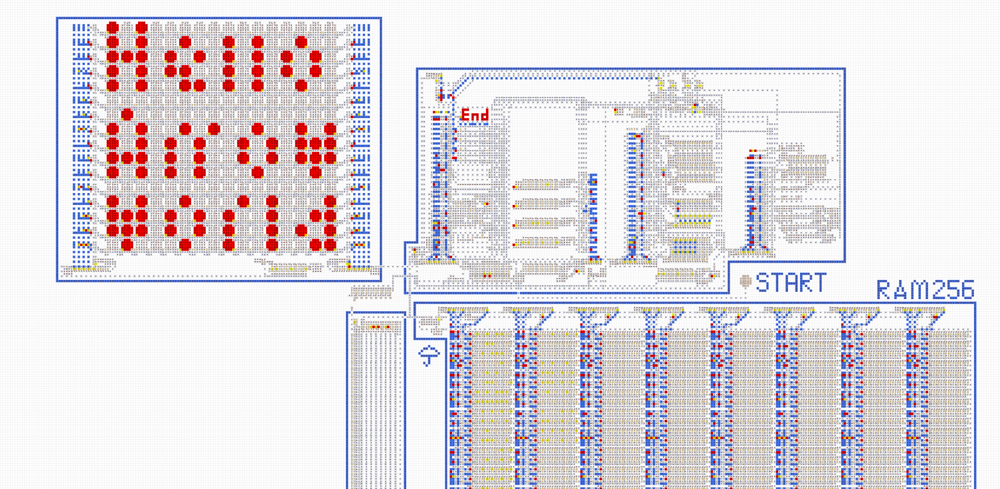](./Компьютер.md)
  

### [Крестики-нолики](https://logic-arrows.io/map-fAgoS31D)
[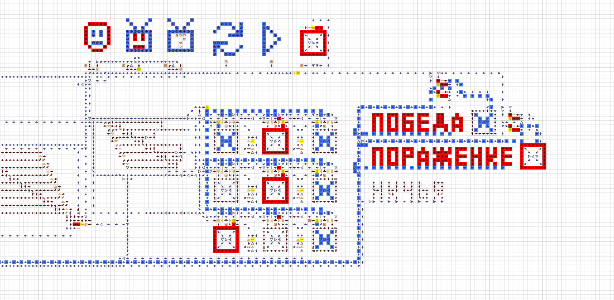](https://logic-arrows.io/map-fAgoS31D)
Полноценные крестики нолики с несколькими режимами игры и ботом, который действительно может составить конкуренцию игроку.
  

### [Графический редактор](https://logic-arrows.io/map-_-oabI2u)
[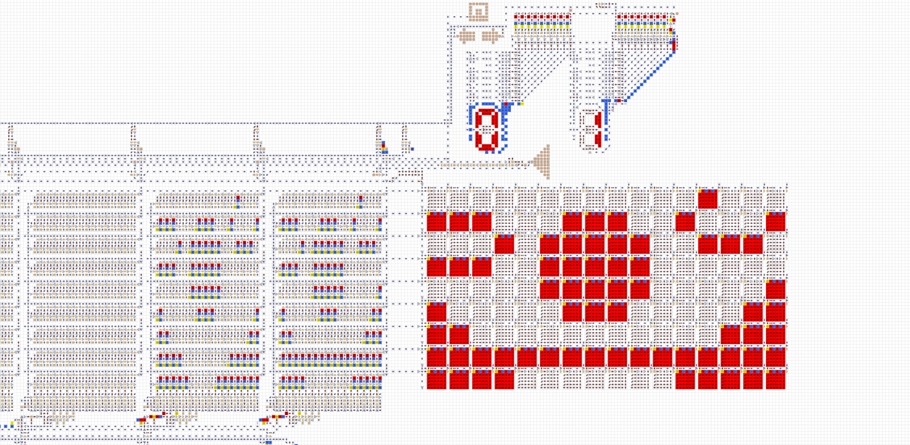](https://logic-arrows.io/map-_-oabI2u)
Графический редактор, имеющий монохромный экран 16 на 9 пикселей. Умеет записывать и читать фото и видео с неограниченным количеством кадров.
  

### [Память на 256 байт](https://logic-arrows.io/map-fefv-L86)
[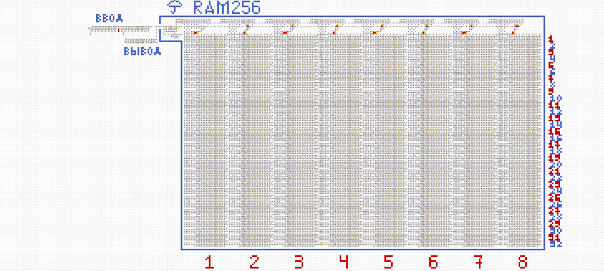](https://logic-arrows.io/map-fefv-L86)
Восьмибитная память, позволяюшая хранить и записывать информацию.
  

### [Волк и яйца](https://logic-arrows.io/map-tUHCbih2)
[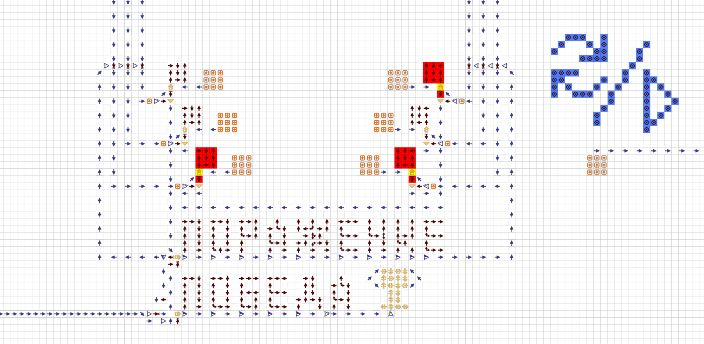](https://logic-arrows.io/map-tUHCbih2)
Игра на основе советской "Волк и яйца". Кнопок несколько больше, но азарт тот же.
  

### [Камень, ножницы, бумага!](https://logic-arrows.io/map-CSOYVeLK)
[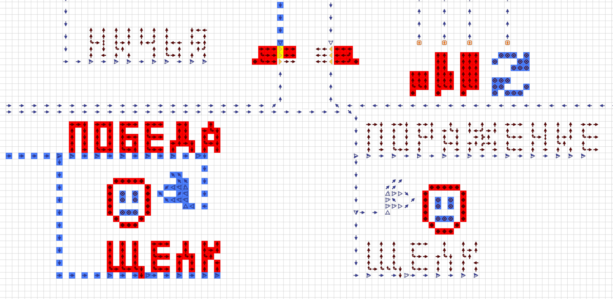](https://logic-arrows.io/map-CSOYVeLK)
Игра с непредсказуемым роботом.
   

## Идея "[Одного байта](https://logic-arrows.io/map-FgY3YPk3)"
[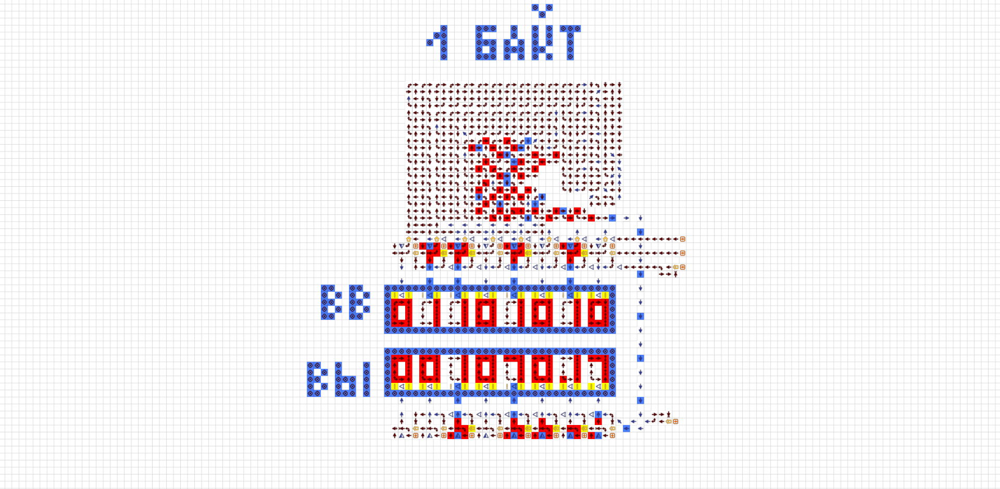](https://logic-arrows.io/map-FgY3YPk3)
Самой первой моей постройкой в стрелочках был заурядный механизм, который получился случайно. Обычно подобное используется в счётчиках. Но тогда я об этом не знал и заметил сходство с двоичным кодом. Все эти карты очень медленные и старые, но мне всё же хотелось бы их показать. Их суть в представлении двоичной системы счисления, как унарной, путём работы с еденицей энергии. Это позволяет проводить любые арифметические операции и переводить их в любые системы счисления.
  

### [Сумматор](https://logic-arrows.io/map-wRwXiE7L)
[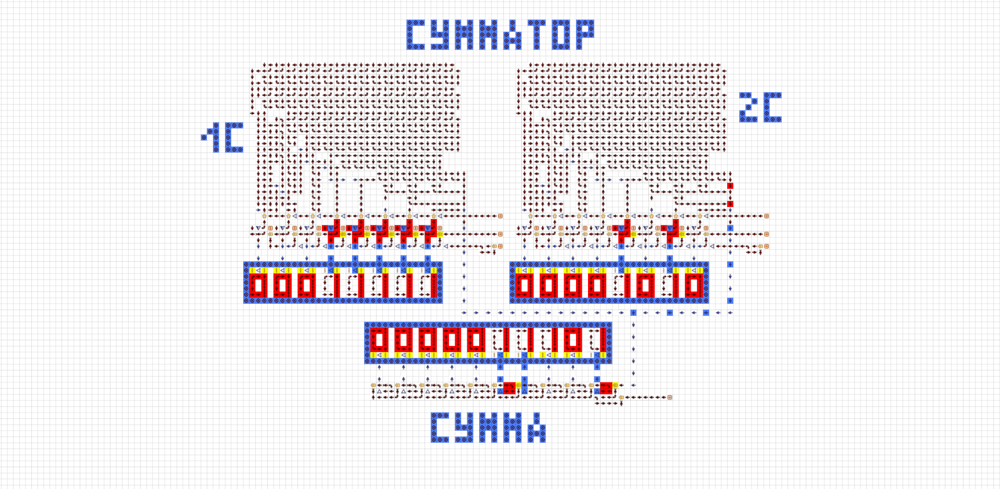](https://logic-arrows.io/map-wRwXiE7L)
Сумматор по факту является двумя "Байтами", соединёнными одним выходом. Но в тот момент он казался мне чем-то совершенным и действительно работающим.
  

### [Вычитатель](https://logic-arrows.io/map-0uUg4loM)
[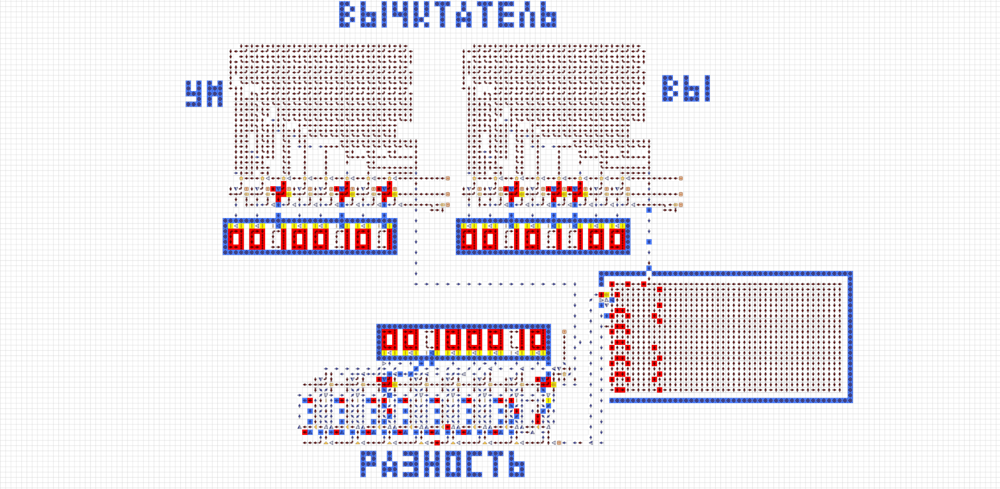](https://logic-arrows.io/map-0uUg4loM)
Вычитатель - модифицированный "Байт". Под ним распологается система со множеством проверок значений для правильного вычитания. Стандартного интревала в две клетки не хватало для правильной работы, и я создал "Клин".
   

### Идея "[Клина](https://logic-arrows.io/map-mTC9srfP)"
[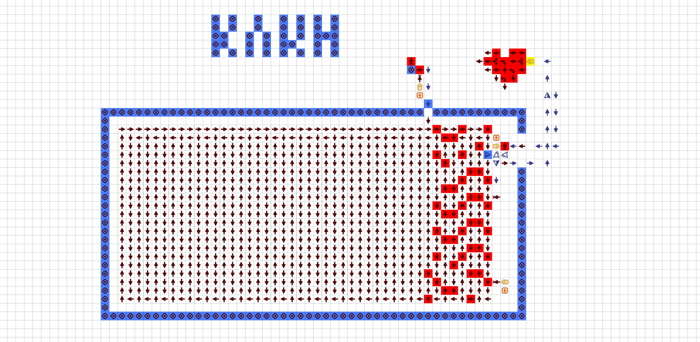](https://logic-arrows.io/map-mTC9srfP)
У унарной системы счисления есть очевидные минусы. В то время как в бинарной 255 является производным восьмиразрядного значения, то в унарной 255 - действительно 255 едениц энергии. Учитывая, что я так же оставлял промежуток в две стрелки для более свободного использования этих значений, то только для перемещения информации уходило много времени. Ведь, например, в сумматоре не просто складывается число N с 0, там складывается 0 с 1 N раз. Это было с каждым действием, а мои механизмы не могли обрабатывать всё так быстро, поэтому я начал использовать "Клин". Проще говоря это огромная батарейка, которая каждый промежуток времени берёт еденицу энергии из хранилища. Это позволило мне сделать много чего, но в разы увеличило размер и медлительность механизмов. Сейчас SunLord уже сделал куда более продвинутую, компактную и быструю модель.
  

### [Умножитель](https://logic-arrows.io/map-iVk6Xl5y)
[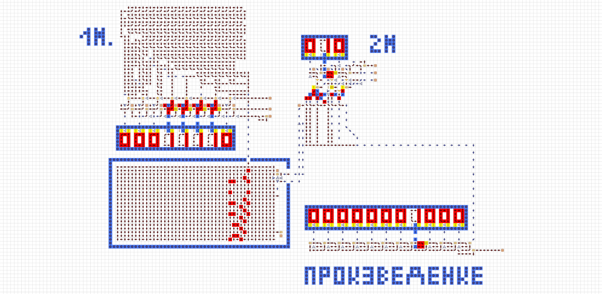](https://logic-arrows.io/map-iVk6Xl5y)
Умножитель превращает одну еденицу энергии в несколько, тем самым и умножая.
  

### [Перевод систем счисления](https://logic-arrows.io/map-BDVkuXh2)

Перевод в десятичную систему счисления происходил с помощью особенных ячеек памяти. Наоборот же, с помощью размазанной по верхушке механизма системе "Байта".
  

### [Делитель](https://logic-arrows.io/map-dVVbg3ZD)
[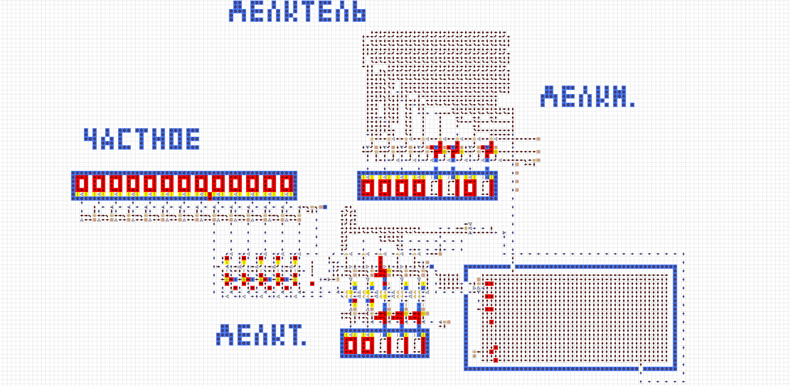](https://logic-arrows.io/map-dVVbg3ZD)
Делитель, умеющий работать с дробными числами. Путём логики и изучения арифметических опреаций в двоичном коде, я вывел формулу для правильной работы делителя. Работает он, сравнивая числа, а после отчищая. Сколько чисел получилось сравнить - такой и будет целая часть. Дробная же умножается на два, а после снова сравнивается. SunLord использовал мой делитель, как основу для его совершенного делителя.
