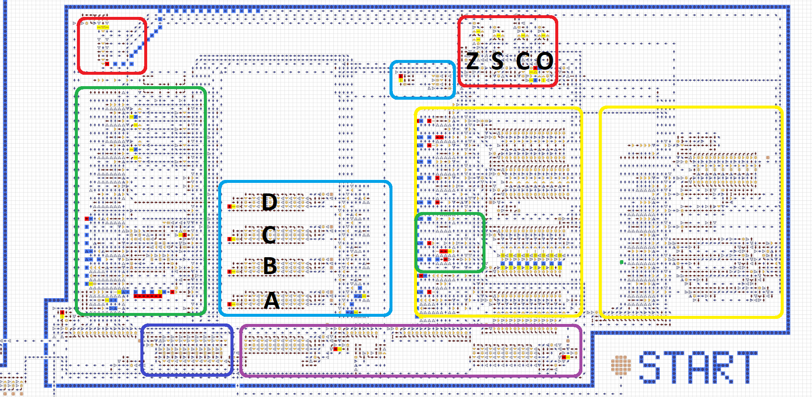

# [Компьютер](https://logic-arrows.io/map-yrERhX_m)

Полноценный компьютер, имеющий:

1. Восьмибитную архитектуру .
2. 39 различных команд.
3. Возможность подключать одновременно 8 устройств вывода и неограниченное число устройств ввода. ["Подробнее тут"](./Ввод-вывод.md)
4. 256 байт оперативной памяти.
6. 4 полностью свободных регистра.
7. 4-рёх разрядный регистр FLAGS.

## О работе компьютера

 
+ 🔴 Красный цвет: регистр FLAGS и утстановка используемого флага.
+ 🔵 Синий цвет: регистр Ip.
+ 🧊 Голубой цвет: регистры A, B, C, D и устройство прочтения X, Y.
+ 🟣 Фиолетовый цвет: устройства для превращения чисел в адреса и шестнадцатибитные значения.
+ 🟢 Зелёный цвет: блок CPU.
+ 🟡 Желтый цвет: блок ALU.
   

Во время его создания я имел чёткое представление о том, что сделаю и следил за структурированностью. Каждая операция располагается между шиной кода операции слева и шиной работы с регистрами справа. В ALU некоторые части шины работы с регистрами были перенесены влево для большей эффективности. После активации операции, сигнал направляет запрос на прочтение какого-либо регистра и/или на изменение работы процессора. После получения значенй они изменяются и отправляются в регистр X.

Регистр Ip работает так, чтобы превращать имеющуюся в нём информацию в адрес, а по запросу этот адрес использовать для прочтения информации в ОЗУ. Через каждую операцию к нему прибавляется 1.

Регистр FLAGS имеет флаги Z; S; C; O, которые выставляются в зависимости от операции и получившегося значения. Над CPU расположено устройство, проверяющее, какой флаг требует команда и при его наличии пускающее сигнал.

Команды In X; Out X; Out X, Y позволяют работать с внешними устройствами. Процессор имеет програмный ввод-вывод, это значит, что внешние порты используются только во время запроса операцией процессора. Благодаря этому моя оперативная память может полностью использоваться для хранения кода. Процессор не нагружет себя выбором используемого устройства, он выводит голые значения, которые уже потом обрабатываются другими устройствами.

Регистры A, B, C, D ялвяются регистрами общего назначения. Их можно использовать как угодно. По факту процессор использует только два регистра: X и Y, но они имеют плавающие адреса, и в зависимости от команды могут быть любыми из четырёх регистров. Для правильного поочерёдного чтения в блоке ALU исползуется небольшой таймер, который позволяет X всегда приходить первым.
  

### Программирование

Процессор имеет собственный ассемблер, каждая команда которого является восьмибитным кодом операции.
["Подробнее тут"](./Программирование.md)  
Любые созданные программы будут находиться в ПЗУ рядом с ОЗУ. При необходимости можно в любой момент перенести данные в ОЗУ. Для создания программы нужно написать код ассемблера и воспользоваться компилятором.
["Подробнее тут"](https://github.com/DimonSDF/DimonSDF-compiler)  

